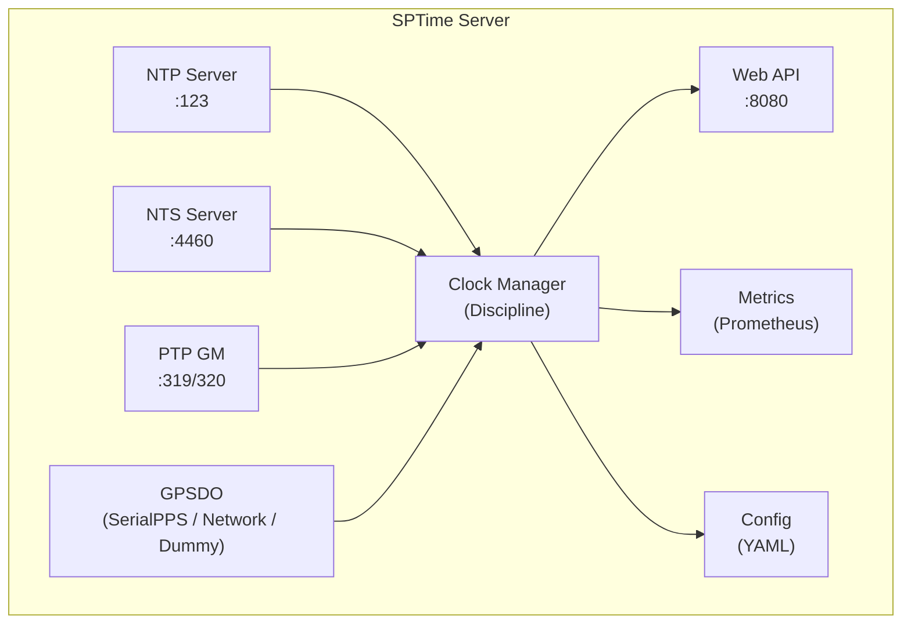

# SPTime - Precision Time Synchronisation Platform

SPTime is a modern, enterprise-grade time synchronisation platform that provides NTP, NTS (Network Time Security), and PTP (Precision Time Protocol) services with optional GPSDO integration for stratum 1 operation.

## Features

- **NTP Server** (RFC 5905 / NTPv4)
  - Stratum 2 operation with upstream peers
  - Stratum 1 capable with GPSDO integration
  - Full packet handling with offset/jitter calculation
  - Configurable upstream peer management

- **NTS (Network Time Security)** (RFC 8915)
  - NTS-KE (Key Establishment) over TLS 1.3
  - Secure cookie management with AES-GCM
  - Session tracking and automatic cleanup

- **PTP Grandmaster** (IEEE 1588-2008 / PTPv2)
  - Default profile support
  - E2E and P2P delay mechanisms
  - Architecture ready for SMPTE 2059 and telecom profiles

- **GPSDO Integration**
  - Serial/PPS support (NMEA + /dev/pps0)
  - Network GPS placeholder for future expansion
  - Dummy mode for testing

- **Modern Web GUI**
  - Real-time dashboard with WebSocket updates
  - NTP peer and GPSDO satellite monitoring
  - Configuration management
  - Log viewer with filtering
  - Prometheus metrics integration

- **Security**
  - JWT-based authentication
  - Role-based access control (admin, operator, viewer)
  - Secure secrets management via environment variables

## Architecture



## Quick Start

### Using Docker Compose (Recommended)

```bash
# Clone the repository
git clone https://github.com/FiLORUX/sptime.git
cd sptime

# Copy and edit configuration
cp deploy/config.example.yaml deploy/config.yaml
# Edit deploy/config.yaml with your settings

# Set JWT secret (important for production!)
export SPTIME_JWT_SECRET=$(openssl rand -hex 32)

# Start the stack
cd deploy
docker-compose up -d

# Access the web interface
open http://localhost
```

### Building from Source

#### Prerequisites

- Go 1.22+
- Node.js 20+
- npm or yarn

#### Backend

```bash
cd backend

# Download dependencies
go mod download

# Build
go build -o sptime ./cmd/server

# Run
./sptime -config /path/to/config.yaml
```

#### Frontend

```bash
cd frontend

# Install dependencies
npm install

# Development server
npm run dev

# Production build
npm run build
```

### Native Linux Installation

```bash
# Create user and directories
sudo useradd -r -s /bin/false sptime
sudo mkdir -p /opt/sptime /etc/sptime /var/lib/sptime /var/log/sptime
sudo chown sptime:sptime /var/lib/sptime /var/log/sptime

# Copy binary and config
sudo cp backend/sptime /opt/sptime/
sudo cp deploy/config.example.yaml /etc/sptime/config.yaml
sudo chown root:sptime /etc/sptime/config.yaml
sudo chmod 640 /etc/sptime/config.yaml

# Install systemd service
sudo cp deploy/systemd/sptime.service /etc/systemd/system/
sudo systemctl daemon-reload
sudo systemctl enable sptime
sudo systemctl start sptime

# Check status
sudo systemctl status sptime
sudo journalctl -u sptime -f
```

## Configuration

SPTime uses a YAML configuration file. See `deploy/config.example.yaml` for all options.

### Environment Variables

Configuration values can be overridden with environment variables:

```bash
export SPTIME_JWT_SECRET="your-secret-key"
export SPTIME_NTS_COOKIE_KEY="your-nts-cookie-key"
```

### Example: Lab Environment (No GPSDO)

```yaml
ntp:
  enabled: true
  port: 123
  stratum: 2
  upstream_peers:
    - address: "time.cloudflare.com:123"
      prefer: true

nts:
  enabled: false

ptp:
  enabled: false

gpsdo:
  enabled: true
  type: "dummy"  # Simulated for testing

web:
  port: 8080
  jwt_secret: "${SPTIME_JWT_SECRET}"
  users:
    - username: "admin"
      password_hash: "$2a$10$..."
      role: "admin"
```

### Example: Production with GPSDO

```yaml
ntp:
  enabled: true
  port: 123
  stratum: 1
  ref_id: "GPS"
  upstream_peers:
    - address: "time.cloudflare.com:123"
      prefer: false  # GPSDO is primary

nts:
  enabled: true
  ke_port: 4460
  cert_path: "/etc/sptime/certs/nts.crt"
  key_path: "/etc/sptime/certs/nts.key"

ptp:
  enabled: true
  interface: "eth0"
  domain: 0
  clock_class: 6  # Primary reference
  two_step_flag: true

gpsdo:
  enabled: true
  type: "serialpps"
  serial_device: "/dev/ttyUSB0"
  serial_baud: 9600
  pps_device: "/dev/pps0"

web:
  port: 8080
  tls_enabled: true
  tls_cert: "/etc/sptime/certs/web.crt"
  tls_key: "/etc/sptime/certs/web.key"
  jwt_secret: "${SPTIME_JWT_SECRET}"
```

## API Reference

### Authentication

```bash
# Login
curl -X POST http://localhost:8080/api/auth/login \
  -H "Content-Type: application/json" \
  -d '{"username": "admin", "password": "admin"}'

# Use token in subsequent requests
curl http://localhost:8080/api/status \
  -H "Authorization: Bearer <token>"
```

### Status Endpoints

| Endpoint | Method | Description |
|----------|--------|-------------|
| `/api/health` | GET | Health check |
| `/api/status` | GET | Complete system status |
| `/api/status/clock` | GET | Clock discipline status |
| `/api/status/ntp` | GET | NTP server status |
| `/api/status/nts` | GET | NTS server status |
| `/api/status/ptp` | GET | PTP grandmaster status |
| `/api/status/gpsdo` | GET | GPSDO status |
| `/api/peers` | GET | NTP peer list |
| `/api/satellites` | GET | GPS satellite info |
| `/api/logs` | GET | Recent log entries |
| `/api/config` | GET/PUT | Configuration |
| `/metrics` | GET | Prometheus metrics |

### WebSocket Endpoints

| Endpoint | Description |
|----------|-------------|
| `/api/ws/status` | Real-time status updates |
| `/api/ws/logs` | Real-time log streaming |

## Prometheus Metrics

SPTime exports metrics in Prometheus format at `/metrics`:

```
# NTP
sptime_ntp_requests_total
sptime_ntp_responses_total
sptime_ntp_offset_seconds
sptime_ntp_jitter_seconds
sptime_ntp_stratum

# NTS
sptime_nts_ke_requests_total
sptime_nts_active_sessions

# PTP
sptime_ptp_sync_total
sptime_ptp_announce_total
sptime_ptp_offset_nanoseconds

# GPSDO
sptime_gpsdo_locked
sptime_gpsdo_satellites
sptime_gpsdo_pps_total

# Clock
sptime_clock_state
sptime_clock_offset_nanoseconds
sptime_uptime_seconds
```

## Project Structure

```
sptime/
├── backend/
│   ├── cmd/server/          # Main entry point
│   └── internal/
│       ├── auth/            # Authentication
│       ├── clock/           # Clock discipline
│       ├── config/          # Configuration
│       ├── gpsdo/           # GPSDO abstraction
│       ├── logging/         # Structured logging
│       ├── metrics/         # Prometheus metrics
│       ├── ntp/             # NTP server
│       ├── nts/             # NTS server
│       ├── ptp/             # PTP grandmaster
│       └── webapi/          # REST API
├── frontend/
│   └── src/
│       ├── api/             # API client
│       ├── components/      # React components
│       ├── pages/           # Page components
│       ├── store/           # Zustand state
│       └── types/           # TypeScript types
├── deploy/
│   ├── docker-compose.yml
│   ├── backend.Dockerfile
│   ├── frontend.Dockerfile
│   ├── nginx.conf
│   ├── config.example.yaml
│   └── systemd/
└── README.md
```

## Security Considerations

1. **Change default credentials** before production deployment
2. **Use TLS** for NTS and web interface in production
3. **Secure JWT secret** - use a strong, random key
4. **Network segmentation** - restrict access to NTP/PTP ports
5. **Regular updates** - keep dependencies updated

## Contributing

Contributions are welcome! Please read our contributing guidelines and submit pull requests.

## Licence

MIT Licence — see LICENSE file for details.

## Acknowledgments

- [beevik/ntp](https://github.com/beevik/ntp) - NTP client library inspiration
- [IEEE 1588](https://www.ieee.org/) - PTP standard
- [RFC 8915](https://datatracker.ietf.org/doc/html/rfc8915) - NTS specification

---

David Thåst · [thåst.se](https://xn--thst-roa.se) · [FiLORUX](https://github.com/FiLORUX)
